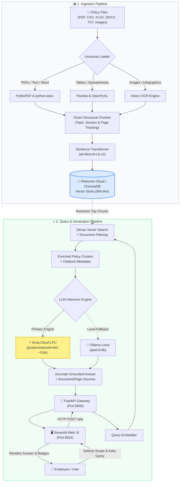

# 🏢 Employee Policy & Knowledge Assistant (RAG)

A high-performance **Retrieval-Augmented Generation (RAG)** system powered by **Groq LPU Cloud Inference**, **Pinecone Cloud Vector Database**, and **Multi-Format Ingestion (PDF, CSV, Excel, Word, Text, and OCR Images)**.

Employees can ask natural language questions regarding corporate guidelines, benefits, and compliance rules, receiving instantaneous, grounded answers with exact document and page citations.

---

## 🏗️ System Architecture & Data Flow



---

## ✨ Key Features

* **⚡ Ultra-Fast Inference:** Powered by **Groq LPU** (`groq/compound-mini`), achieving sub-second (~0.8s – 1.4s) answer generation.
* **🌲 Scalable Cloud Vectors:** Serverless **Pinecone Cloud Vector Database** with cosine similarity indexing and metadata filtering.
* **📂 Universal Multi-Format Support:**
  * 📄 **PDFs:** Page-by-page text extraction with header tracking.
  * 📊 **Spreadsheets:** Row-and-column semantic mapping for `.csv`, `.xlsx`, and `.xls`.
  * 📝 **Documents:** `.docx`, `.doc`, `.txt`, `.md` structured parsing.
  * 📸 **Image OCR:** Scanned policies, infographics, and posters (`.png`, `.jpg`, `.jpeg`, `.webp`, `.tiff`, `.bmp`).
* **🎯 Knowledge Base Scoping:** Search across all documents simultaneously or isolate queries to a specific policy.
* **🔍 Dynamic Suggested Questions:** Instant question prompts that automatically adapt based on the selected document scope.
* **🛡️ Zero Hallucinations:** Strict grounding rules prevent fabricated answers when questions fall outside company policies.
* **🎨 Modern Streamlit UI:** Premium interface with citation pills, scope switcher, dynamic badges, and document deletion management.

---

## 🚀 Getting Started

### 1. Clone & Install Dependencies
```bash
# Clone the repository
git clone https://github.com/sydelendure/Rag-assistant.git
cd Rag-assistant

# Create and activate virtual environment
python3 -m venv .venv
source .venv/bin/activate

# Install requirements
pip install -r requirements.txt
```

### 2. Configure Environment Variables
Copy the template configuration and add your API keys:
```bash
cp .env.example .env
```

Edit `.env`:
```env
# Vector Store Engine
VECTOR_STORE_TYPE=pinecone

# Pinecone Credentials (https://app.pinecone.io)
PINECONE_API_KEY=your_pinecone_api_key_here
PINECONE_INDEX_NAME=employee-policy-rag

# Groq Cloud Credentials (https://console.groq.com/keys)
GROQ_API_KEY=your_groq_api_key_here
GROQ_MODEL=groq/compound-mini
```

---

## 🏃 Running the Application

### Option A: One-Click Start (Recommended)
Run both the **FastAPI Backend** and **Streamlit UI** simultaneously:
```bash
./start.sh
```

### Option B: Manual Start in Separate Terminals

**Terminal 1 — FastAPI Backend:**
```bash
source .venv/bin/activate
PYTHONPATH=. uvicorn app.api.main:app --host 127.0.0.1 --port 8000 --reload
```
* Interactive API Documentation: [http://127.0.0.1:8000/docs](http://127.0.0.1:8000/docs)

**Terminal 2 — Streamlit Frontend:**
```bash
source .venv/bin/activate
streamlit run ui.py
```
* Web Application: [http://localhost:8501](http://localhost:8501)

---

## 🧪 Testing & Verification

Run the automated test suite covering 6 policy domains, negative out-of-scope queries, and document scope isolation:
```bash
.venv/bin/python test_rag_rigorous.py
```

---

## 📡 API Endpoints Reference

| Method | Endpoint | Description |
| :--- | :--- | :--- |
| `GET` | `/health` | Service health, vector store status, LLM engine & chunk count |
| `POST` | `/ask` | Ask natural language questions with optional document scoping |
| `GET` | `/documents` | List all indexed policy documents with metadata |
| `POST` | `/documents/upload` | Upload & index any supported file (`.pdf`, `.csv`, `.xlsx`, `.docx`, `.png`, etc.) |
| `DELETE` | `/documents/{filename}` | Delete a document and purge its vectors from the database |